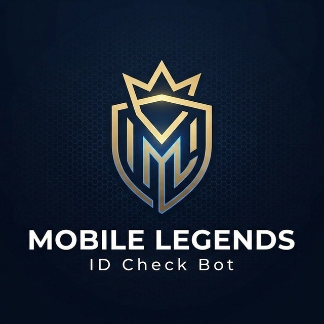

<div align="center">



# MLBB Server Detector Bot

**Mobile Legends: Bang Bang uchun Telegram bot — serverni 1 soniyada aniqlang.**

[](https://t.me/checkmlbbidBot)
[](LICENSE)
[](./lang/uz.json)
[](./lang/ru.json)
[](./lang/kz.json)

</div>

---

## Bu nima?

MLBB Server Detector Bot — Mobile Legends: Bang Bang o'yin ID orqali serverni aniqlash, ulanmalarni tekshirish va to'liq profil ko'rish imkonini beruvchi bepul Telegram bot.

**Landing page** — bot haqida ma'lumot beruvchi zamonaviy veb-sayt.

🔗 **Bot:** [t.me/checkmlbbidBot](https://t.me/checkmlbbidBot)

---

## Imkoniyatlar

| Imkoniyat | Tavsif |
|-----------|--------|
| 🔍 **Server aniqlash** | O'yin ID ni yuboring — qaysi serverda ekanligingizni darhol aytadi |
| 🔗 **Ulanmalar tekshirish** | Akkauntingiz qaysi qurilmalarga bog'langanini ko'ring |
| 👤 **To'liq profil** | Rank, herolar, statistika — barchasi bitta xabarda |
| ⚡ **Inline rejim** | Istalgan chatda @bot + ID yozing, guruhdan chiqmagan holda tekshiring |

---

## Landing Page Xususiyatlari

- **3 tilli qo'llab-quvvatlash** — O'zbek, Русский, Қазақша
- **Dark / Light tema** — avtomatik aniqlash yoki qo'lda almashtirish
- **Responsive dizayn** — desktop va mobile uchun moslashuvchan
- **Testimonial slider** — foydalanuvchilar sharhlari avtomatik siljiydi
- **Scroll animatsiyalar** — IntersectionObserver asosida
- **SEO optimallashtirilgan** — meta teglar, Open Graph

---

## Loyiha Tuzilishi

```
mlbbcheckbot-landingpage/
├── index.html          # Asosiy HTML fayl
├── style.css           # Barcha stillar (dark/light, responsive)
├── script.js           # Frontend logikasi (i18n, tema, animatsiyalar)
├── lang/
│   ├── uz.json         # O'zbek tarjimalari
│   ├── ru.json         # Rus tarjimalari
│   └── kz.json         # Qozoq tarjimalari
└── public/
    └── logo.jpg        # Bot logosi
```

---

## Ishga Tushirish

Landing page statik fayl — server kerak emas. Istalgan brauzerda ochish mumkin.

### Lokalda ko'rish

```bash
# Loyiha papkasiga o'tish
cd mlbbcheckbot-landingpage

# Python bilan vaqtincha server
python3 -m http.server 8000

# Keyin brauzerda oching
open http://localhost:8000
```

### yoki Live Server (VS Code)

1. [Live Server](https://marketplace.visualstudio.com/items?itemName=ritwickdey.LiveServer) o'rnating
2. `index.html` oching
3. "Go Live" bosing

---

## Qanday Ishlaydi

### Frontend Arxitekturasi

- **HTML** — semantik tuzilama, `data-i18n` atributlari orqali tarjima
- **CSS** — Custom Properties (CSS Variables) orqali tema almashtirish
- **JavaScript** — Vanilla JS, framework talab qilmaydi

### i18n Tizimi

Har bir matn elementiga `data-i18n="kalit_nomi"` atributi qo'yilgan. Til almashtirilganda `script.js` JSON fayldan tarjimalarni yuklaydi va DOM elementlarini yangilaydi.

### Tema Tizimi

`data-theme="dark|light"` atributi `<html>` tegiga o'rnatiladi. CSS Custom Properties orqali barcha ranglar avtomatik o'zgaradi. Foydalanuvchi tanlovi `localStorage` da saqlanadi.

### Testimonial Slider

CSS `@keyframes` animatsiyasi orqali 10 ta sharh kartochkasi o'ngdan chapga cheksiz siljiydi. Hover qilganda slider to'xtaydi.

---

## Texnologiyalar

| Texnologiya | Maqsad |
|-------------|--------|
| HTML5 | Semantik tuzilama |
| CSS3 | Stillar, animatsiyalar, responsive |
| Vanilla JavaScript | Frontend logikasi |
| CSS Custom Properties | Dark/Light tema |
| IntersectionObserver | Scroll animatsiyalar |
| Fetch API | Tarjimalarni yuklash |

---

## Bot haqida

Telegram bot Node.js yozilgan va quyidagi API'lardan foydalanadi:

- **Telegram Bot API** — asosiy interfeys
- **MLBB Lookup API** — o'yin ma'lumotlarini olish
- **Supabase** — ma'lumotlar bazasi
- **Telegraph** — uzun natijalarni ko'rish

Bot funksiyalari:
- Server aniqlash (ID orqali)
- Ulanmalarni tekshirish
- To'liq profil ko'rish
- Inline rejim
- Admin paneli (statistika, broadcast)

---

## Qatnashish

1. Fork qiling
2. Branch yarating (`git checkout -b feature/yangi-xususiyat`)
3. O'zgartirishlarni commit qiling (`git commit -m 'Yangi xususiyat qo'shildi'`)
4. Push qiling (`git push origin feature/yangi-xususiyat`)
5. Pull Request yarating

---

## Litsenziya

Bu loyiha ochiq manbadir. Foydalanish uchun litsenziya talab qilinmaydi.

---

<div align="center">

**Mobile Legends: Bang Bang** — Moonton kompaniyasining savdo belgisi.
Bu bot Moonton bilan bog'liq emas.

</div>
